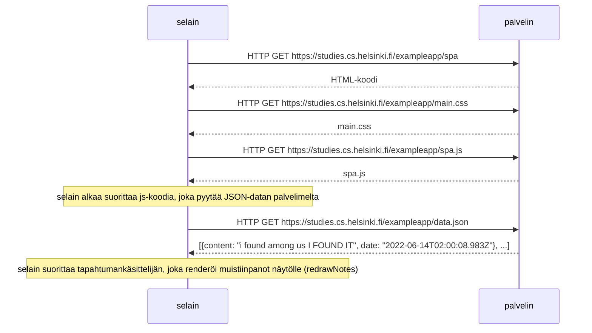

```mermaid
sequenceDiagram
	participant selain
	participant palvelin

	selain ->> palvelin: HTTP GET https://studies.cs.helsinki.fi/exampleapp/spa
	palvelin -->> selain: HTML-koodi
	selain ->> palvelin: HTTP GET https://studies.cs.helsinki.fi/exampleapp/main.css
	palvelin -->> selain: main.css
	selain ->> palvelin: HTTP GET https://studies.cs.helsinki.fi/exampleapp/spa.js
	palvelin -->> selain: spa.js

	Note over selain: selain alkaa suorittaa js-koodia, joka pyytää JSON-datan palvelimelta

	selain ->> palvelin: HTTP GET https://studies.cs.helsinki.fi/exampleapp/data.json
	palvelin -->> selain: [{content: "i found among us I FOUND IT", date: "2022-06-14T02:00:08.983Z"}, ...]

	Note over selain: selain suorittaa tapahtumankäsittelijän, joka renderöi muistiinpanot näytölle (redrawNotes)
```